# SeatsLabs Backend - Class Diagram

> **Visual representation of all backend controllers and their methods**  
> **Format:** Mermaid UML Class Diagram  
> **Last Updated:** February 20, 2026

---

## How to View This Diagram

This diagram uses Mermaid syntax. You can view it in:

- GitHub/GitLab (auto-renders)
- VS Code with Mermaid extension
- Online at https://mermaid.live/

---

## Complete Backend Class Diagram


---

## Simplified View: Controllers by Category

```mermaid
graph TB
    subgraph Authentication["🔐 Authentication"]
        AUTH[authController]
        AUTHMW[authMiddleware]
    end

    subgraph UserManagement["👥 User Management"]
        USER[userController]
        CUSTOMER[customerController]
        TECH[technicianController]
    end

    subgraph ServiceManagement["🔧 Service Management"]
        SCAT[serviceCategoryController]
        SERVICE[serviceController]
        PACKAGE[servicePackageController]
        TIMESLOT[timeSlotController]
    end

    subgraph BookingSystem["📅 Booking & Tracking"]
        BOOKING[bookingController]
        TRACKING[trackingController]
        FEEDBACK[feedbackController]
    end

    subgraph Advertising["📢 Advertising"]
        AD[advertisementController]
        CAMPAIGN[campaignController]
        PLACEMENT[placementController]
    end

    subgraph Financial["💰 Financial"]
        PAYMENT[paymentController]
        REFUND[refundController]
    end

    subgraph Support["📞 Support & Config"]
        COMPLAINT[complaintController]
        SETTINGS[settingsController]
    end

    subgraph Reporting["📊 Reporting"]
        REPORT[reportController]
    end

    subgraph Database["💾 Database"]
        DB[(PostgreSQL Pool)]
    end

    %% Middleware protects all
    AUTHMW -.->|protects| UserManagement
    AUTHMW -.->|protects| ServiceManagement
    AUTHMW -.->|protects| BookingSystem
    AUTHMW -.->|protects| Advertising
    AUTHMW -.->|protects| Financial
    AUTHMW -.->|protects| Support
    AUTHMW -.->|protects| Reporting

    %% All use database
    Authentication -->|uses| DB
    UserManagement -->|uses| DB
    ServiceManagement -->|uses| DB
    BookingSystem -->|uses| DB
    Advertising -->|uses| DB
    Financial -->|uses| DB
    Support -->|uses| DB
    Reporting -->|uses| DB

    %% Cross-module dependencies
    BookingSystem -->|reads| ServiceManagement
    BookingSystem -->|reads| UserManagement
    Financial -->|reads| BookingSystem
    Reporting -->|analyzes| BookingSystem
    Reporting -->|analyzes| Advertising

    style Authentication fill:#e1f5fe
    style UserManagement fill:#f3e5f5
    style ServiceManagement fill:#e8f5e9
    style BookingSystem fill:#fff3e0
    style Advertising fill:#fce4ec
    style Financial fill:#e8eaf6
    style Support fill:#fff8e1
    style Reporting fill:#f1f8e9
    style Database fill:#efebe9
```



---

## Controller Method Statistics

| Controller                    | Public Methods | Private Methods | Total  |
| :---------------------------- | :------------- | :-------------- | :----- |
| **authController**            | 2              | 0               | 2      |
| **userController**            | 4              | 0               | 4      |
| **customerController**        | 4              | 0               | 4      |
| **technicianController**      | 5              | 0               | 5      |
| **serviceCategoryController** | 4              | 0               | 4      |
| **serviceController**         | 5              | 0               | 5      |
| **servicePackageController**  | 4              | 0               | 4      |
| **timeSlotController**        | 4              | 0               | 4      |
| **bookingController**         | 5              | 1               | 6      |
| **trackingController**        | 3              | 0               | 3      |
| **feedbackController**        | 5              | 0               | 5      |
| **advertisementController**   | 6              | 0               | 6      |
| **campaignController**        | 6              | 0               | 6      |
| **placementController**       | 4              | 0               | 4      |
| **paymentController**         | 5              | 0               | 5      |
| **refundController**          | 4              | 0               | 4      |
| **complaintController**       | 4              | 0               | 4      |
| **settingsController**        | 2              | 0               | 2      |
| **reportController**          | 4              | 0               | 4      |
| **authMiddleware**            | 2              | 0               | 2      |
| **TOTAL**                     | **82**         | **1**           | **83** |

---

## Method Access Patterns


---

## Complete Database ER Diagram


---

## API Request Flow

```mermaid
sequenceDiagram
    participant Client
    participant AuthMW as authMiddleware
    participant AuthzMW as authorizeRole
    participant Controller
    participant DB as Database

    Client->>+AuthMW: HTTP Request + JWT Token
    AuthMW->>AuthMW: Verify JWT Token
    alt Token Valid
        AuthMW->>AuthMW: Decode & Attach User
        AuthMW->>+AuthzMW: Check Role Permission
        alt Role Authorized
            AuthzMW->>+Controller: Execute Business Logic
            Controller->>+DB: Query Database
            DB-->>-Controller: Return Data
            Controller-->>-AuthzMW: Response Data
            AuthzMW-->>-AuthMW: Pass Response
            AuthMW-->>-Client: 200 Success + Data
        else Role Unauthorized
            AuthzMW-->>Client: 403 Forbidden
        end
    else Token Invalid
        AuthMW-->>-Client: 401 Unauthorized
    end
```

---

**End of Class Diagram Documentation**
